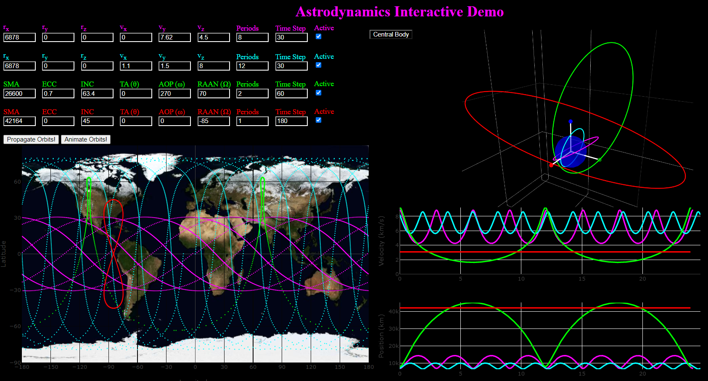

# AID - Astrodynamics Interactive Demo

`AID` is a zero dependency tool on the browser (deployed via GitHub Pages) created to easily experiment with the relationship between initial orbital conditions (by state vector or keplerian orbital elements), 3D orbits, groundtracks, and position / velocity magnitude vs. time.

This tool is implemented with a number of simplifications (two-body differential equations of motion, Runge-Kutta 4 constant step size ODE solver, rotating reference frame calculation solely as z-axis rotation of central body), so it should only be used ONLY as a visual aid. For higher fidelity simulations and more variety of analysis, one should use the [Astrodynamics with Python](https://github.com/alfonsogonzalez/AWP) tools.

## How To Use
One can input initial conditions of orbits either by state vector (position and velocity) or keplerian orbital elements. There is also an option to choose a central body (Earth, Moon, or Mars). Each entry can be activated/deactivated with their corresponding checkbox labeled "Active".

After any changes are made, click the `Propagate Orbits!` button to update the plots.

### State Vectors
`r` = position, `v` = velocity

### Keplerian Orbital Elements
* SMA  - Semi-Major Axis
* ECC  - Eccentricity
* INC  - Inclination
* TA   - True Anomaly
* AOP  - Argument of Periapsis
* RAAN - Right Ascension of the Ascending Node

### Periods
For bounded orbits (circular and elliptical), the tool calculates the orbital period of given the initial conditions of the orbit, so the user only needs to input how many periods they would like the solver to propagate.

For unbounded orbits (parabolic and hyperbolic) the period is undefined, therefore the tool propagates for a pre-defined amount of time. However, the user can override that by inputting the number of seconds the solver should propagate in the Periods entry. Here is the logic:

The state2period function will return `NaN` (Not a Number) for hyperbolic orbits, since the function takes a square root of a negative number (the semi-major axis is defined as negative for unbounded orbits). If that happens, the tool checks the `Periods` entry. If the value in the `Periods` entry is greater than 50, then the tool will use that value. Else, the tool uses the pre-defined length of time `HYPERBOLIC_TSPAN`

### Time Step
Amount of time (in seconds) between each propagation step.

## Default Entry Values
### Earth
1. 500km altitude, equatorial, circular orbit
2. Eccentric, near-polar orbit
3. Eccentric, 60 degree inclination orbit
4. Geostationary orbit

### Moon
1. Equatorial, eccentric orbit
2. Polar, eccentric orbit
3. 50km altitude, circular orbit (`~`Lunar Reconnaissance Orbiter)
4. Near-polar, eccentric orbit

### Mars
1. Equatorial, near circular orbit
2. Near polar, near circular orbit (`~`Mars Reconnaissance Orbiter)
3. Inclined, highly elliptical orbit (interesting groundtracks)
4. Inclined, near circular orbit

## Animate Orbits Functionality
This functionality is a bit of a work in progress, since its *works* but there are improvements to be made to eliminiate the lag of the animations and a small bug in the position and velocity vs. time plots. Nevertheless I hope you find it useful and it will be improved over time. To use, simply click the `Animate Orbits!` button.

## Interesting Use Cases
### Posigrade Burns, Experimenting with Escape Velocity
The first default orbit in the Earth case is set up to do this since its defined solely by 1 position and 1 velocity value. So one can adjust the `v_y` value to increase eccentricity. When inputting values close to escape velocity (`~`10.7km/s), the program will run much slower. This is because the plot is showing thousands of data points since the period of the very eccentric orbit is very large, and it could crash (stack overflow! Since the amount of memory needed to store that many floating point numbers exceeds the stack limit). 

### Relationship Between Orbital Inclination and Latitude Coordinates
Orbital inclination is defined as the angle between the orbital plane and the central body's equatorial plane. Try experimenting with different inclination values and noting what the minimum and maximum latitude coordinates of the groundtrack plots are for that orbit (even for the very weirdly shaped groundtracks!)

### Geosynchronous and Geostationary Orbits
Geosynchronous orbits are defined as orbits that have an orbital period of 1 sidereal day. Note that there is a difference between a solar day (Earth rotating once with respect to the Sun) and a sidereal day (Earth rotating once with respect to the inertial frame).
Try activating the 4th (red) default orbit for Earth. The orbital parameters are for a geostationary orbit, which is defined as an orbit that is stationary with respect to the surface of the Earth (which is rotating). Geostationary orbits are a special case of geosynchronous orbits, where they are restricted to be circular and equatorial (zero inclination). What does it's groundtrack look like?

Now experiment with the orbital inclination. Why is the groundtrack that very specific shape? Also try experimenting with the eccentricity.

### Molniya Orbits
Molniya orbits have a very distinct property that they hover over specific northern latitude regions for a relatively long time. Try the following parameters:
* SMA = 26600
* ECC = 0.7
* INC = 63.4
* TA  = Anything
* AOP = 270
* RAAN = 70

Could you think of any reasons why these orbits could have been useful during the Cold War? Also, try experimenting with different values for RAAN.

### General Groundtracks Readings
As you may have seen, sometimes groundtracks can have very interesting shapes and can be seemingly random as to why certain orbital parameters correspond to those shapes. This is because they are a function of the rotation rate and gravitational parameter of the central body. However, one can still deduce some characteristics of an orbit given a groundtracks plot:
* The most straightforward orbital element to read is the inclination, due to the definition of orbital inclination with respect to the reference plane (usually the equatorial plane)
* Assuming all points are plotted with equal time steps, one can get an idea of eccentricity. If all the points are relatively evenly spaced, one can assume the orbit is near circular. But if there are some points of the orbit where the points are closer together than others, one can assume a larger eccentricity, since the close together points correspond to around apoapsis, and the more spaced out points correspond to around periapsis.

## Bug Reporting / Feature Request
Both are welcomed, feel free to do so by creating a GitHub Issue.
Note that if you actively try to break something, you'll probably break it. I'm sure it wouldn't be hard to find bugs here if you're looking for them.
Also, note that as was said in the beginning, this is simply meant to be a visual aid for building intuition about the relationships between different values in orbits. More complex analysis should be done via scripting (my preferences are Python and C++).

## Summary

## TO-DO LIST
### Backend
* Implement TLE to state vector function
* Implement J2 perturbation
* Implement adaptive step size solver

### Frontend
* Entries for each orbit
	* Constant time step or choose adaptive step size solver

